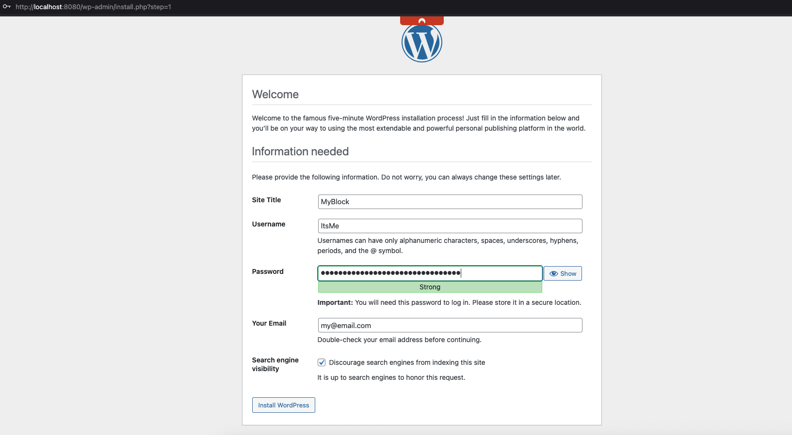
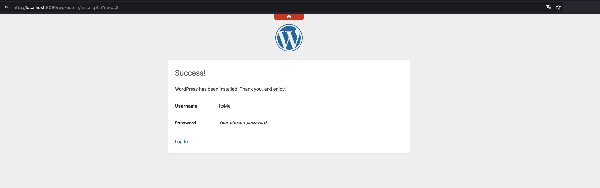
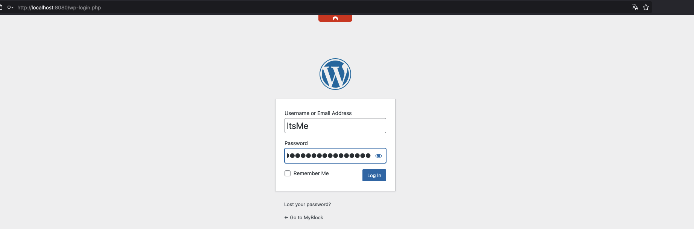
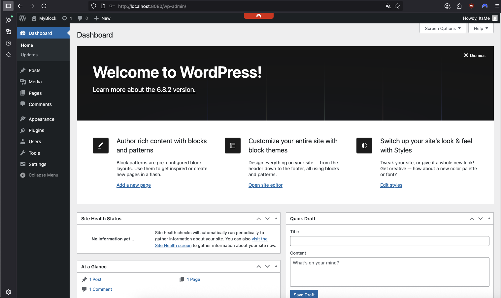
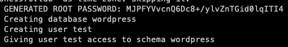

# Project WordPress 

The goal of this project is to dockerize WordPress.

## Table of content

1. [Prerequisites](#Prerequisites)
2. [Quickstart](#Quickstart)
3. [Usage](#Usage)
4. [Notes](#Notes)

### Prerequisites

- Git
- Docker
- Docker Compose v2

### Quickstart

- Open a terminal

- Navigate to a folder of choice

```bash
cd my/test/folder
```

- Clone the project

```bash
git clone https://github.com/reiloe/wordpress.git
```

- Navigate into the root folder (named wordpress)

```bash
cd wordpress
```

- Here you will find a file named example.env. Copy this file and rename it in .env.

```bash
cp example.env .env
```

> [!NOTE]
> WordPress typically starts on port 8080.  
> If you need to change this port you can do this in the .env file.
 
> [!NOTE]
> WordPress stores data in a database. This requires a database user.
> This values you will find in the .env file too.
> If you want you can change this value there.

- run the following command:

```bash
docker compose up
```

After a short time, WordPress is ready to use. 

### Usage
 
Open a browser and enter localhost:8080 [^1] to start configuration of WordPress.
[^1]: If you have changes the port number during setup, you must enter this port

First you need to chose your language


After that, you have to input some information (eg. username and password) [^2]
[^2]: NOT the user/pass from .env file



A success message shows that WordPress is completely initialized and ready to use.



When you click “Log in,” you will be redirected to your WordPress login page.



When you log in with the username and password you just created, you will be taken to your WordPress dashboard. 



Happy WordPressing

### Notes

A root user is created for the database during setup. The root user's password can be found in the logs immediately after starting the database.



***

If you want to re-setup WordPress completely run the following command inside the project folder:

```bash
docker compose down -v
```

> [!CAUTION]  
> You will completely remove WordPress and lose all your data and settings.!!!

and run the whole process from [Quickstart](#Quickstart) again.

***

If you want to run the setup without configuring the .env file you can run the following command:

```bash
docker compose up -e WORDPRESS_PORT=8080 -e DB_USER=MyDbUser -e DB_PASS=MyDbPass -e DB_NAME=MyWordPress
```

> [!NOTE]  
> Replace the values for the port, database user, and password according to your preferences.